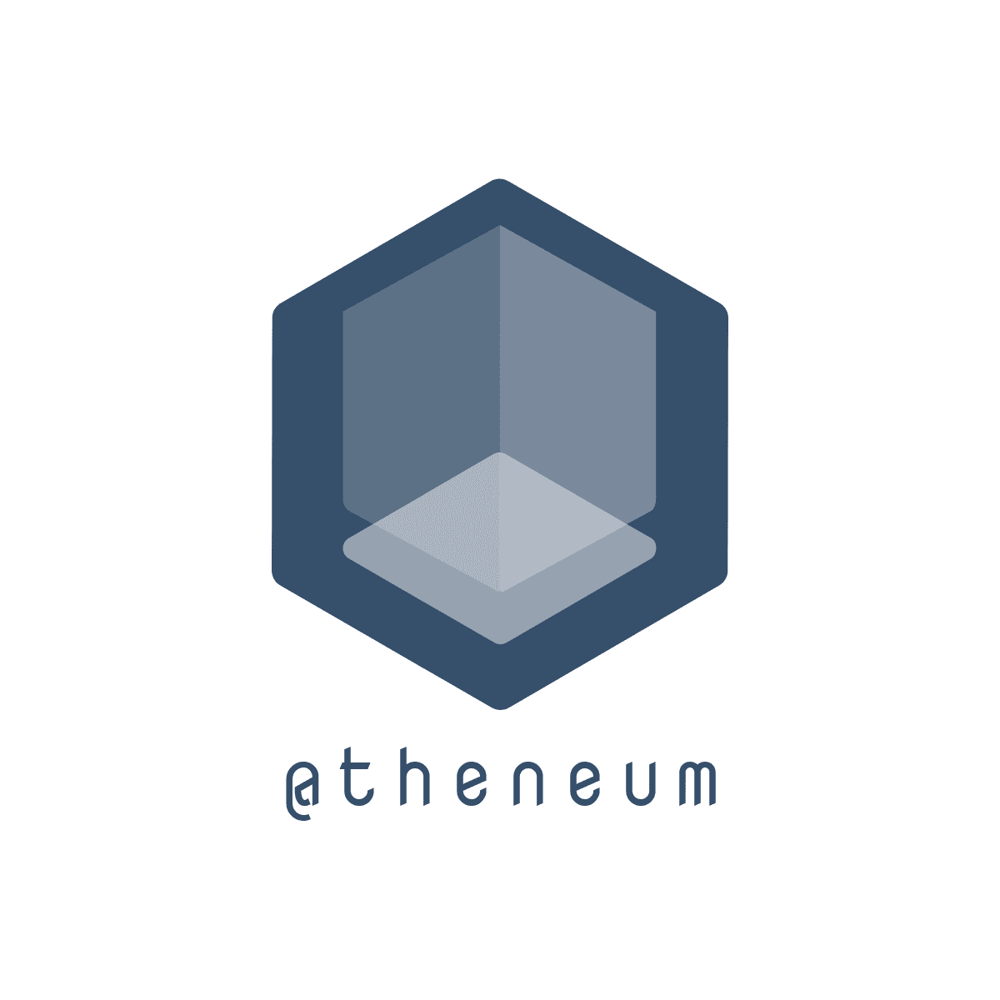

<p align="center">
</p>

<p align="center">
<a href="https://github.com/tailwindlabs/tailwindcss/actions"></a>
<a href="https://www.npmjs.com/package/@atheneum/atheneum"></a>
<a href="https://github.com/emilohlund-git/atheneum/releases"></a>
<a href="https://github.com/emilohlund-git/atheneum/blob/master/LICENSE"></a>
</p>

---

<h1 align="center">@theneum CLI</h1>
<p>Start the CLI with:</p>

```
npm run dev
```	
<p>Navigate to the folder where you would like to create a component and run the command:</p>

```
create-component <component_name>
```	

